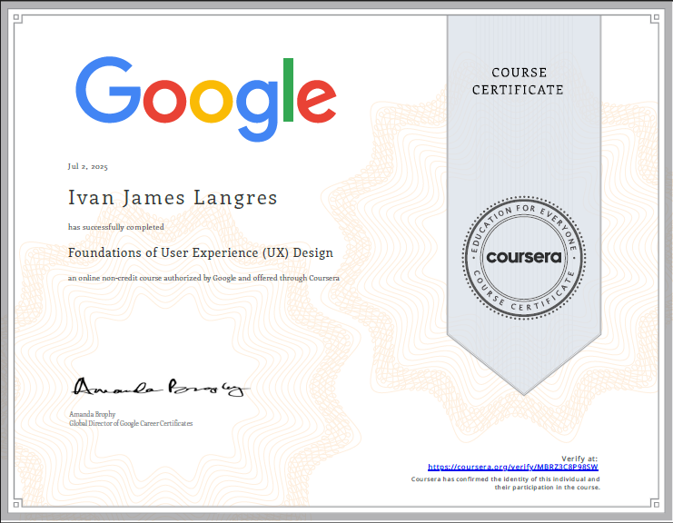
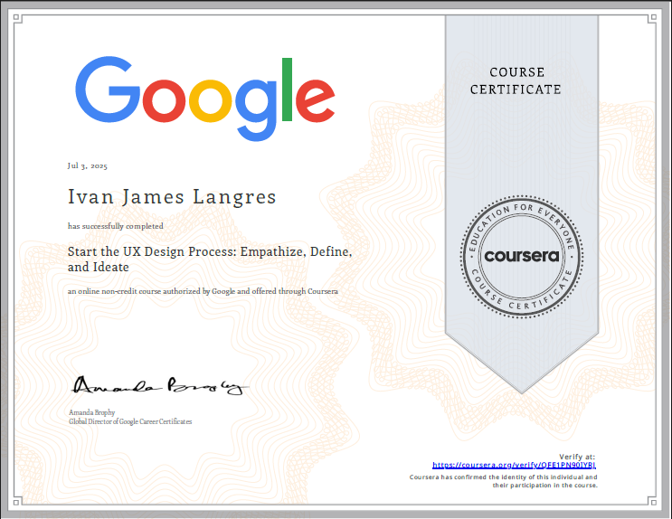
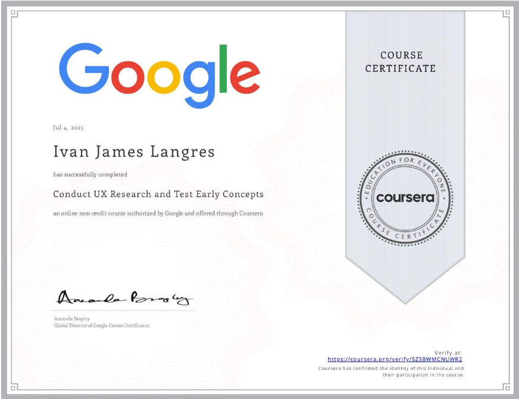
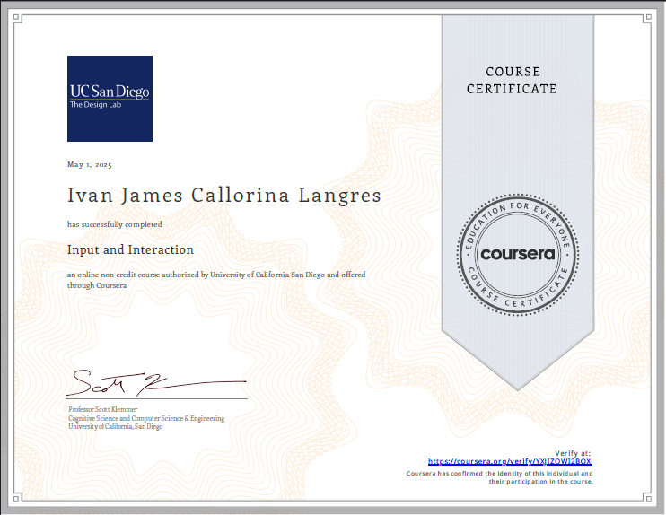
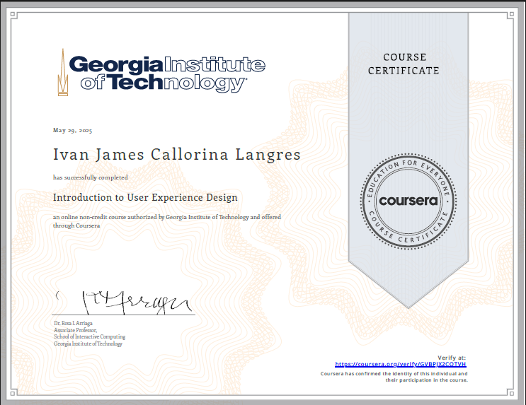

# 👨‍💻 Ivan James Langres – Portfolio

<h3 align="center">
<a href="https://github.com/IvanJames25">School Portfolio</a> •
<a href="https://www.linkedin.com/in/ivan-james-langres-aa93bb275">LinkedIn</a> •
<a href="https://www.figma.com/design/pHAOW9XRJTtZFc4CsqkBm0/HCI?node-id=69-946&p=f&m=draw">Figma Prototype</a>
</h3>

---

# 📌 About Me

Hi! I'm **Ivan James Langres**, a student passionate about **UX/UI Design, Technology, and Data Analysis**.

I enjoy designing **user-friendly digital experiences** and have created several **UX/UI prototypes using Figma**. My goal is to expand my skills by learning **coding and development**, allowing me to transform my designs into **fully functional digital products**.

I am also interested in **data-driven design**, where data insights help improve usability and decision-making in digital systems.

---

# 👥 Team Project – TEAM ADL

### TEAM ADL – Avila • Dorado • Langres

**CYFER** is a **secure password manager** designed to help users safely store and manage credentials.

### Key Features

• Secure encrypted password vault  
• Intuitive and user-friendly interface  
• Credential storage and management  
• Cross-device synchronization  

The goal of CYFER is to provide a **safe and efficient way for users to store and manage their digital credentials.**

---

# 🚀 Other Projects

<h2 align="center">AI-Powered Automation: Future of E-Commerce</h2>

<table>
<tr>
<td align="center">

</td>

<td align="center">

</td>
</tr>
</table>

---

# 📖 Usage Instructions

## 🔐 User Authentication
A. Login to CYFER vault  
B. Enable multi-factor authentication (optional)

## 🔑 Password Management
A. Add new credentials (username, password, URL)  
B. Edit existing credentials  
C. Delete credentials  

## 📂 Organizing Credentials
A. Create categories or folders  
B. Move credentials between folders  

## 🔍 Password Retrieval
A. Search credentials by keyword or category  
B. Copy or auto-fill passwords  

## 🔄 Synchronization
A. Sync vault data across devices  

## ⚙️ Settings and Security
A. Change master password  
B. Enable biometric authentication  
C. Configure synchronization preferences  

---

# 📚 User Manual

### Figma Prototype
https://www.figma.com/design/pHAOW9XRJTtZFc4CsqkBm0/HCI?node-id=69-946&p=f&m=draw

### Project Documentation

• [Part 1](https://malayancollegesmindanaoo365-my.sharepoint.com/personal/macavila_mcm_edu_ph/_layouts/15/onedrive.aspx?id=%2Fpersonal%2Fmacavila%5Fmcm%5Fedu%5Fph%2FDocuments%2F2024%2D2025%2FHCI%2FModule%202%2FTEAM%20ADL%2Epdf)

• [Part 2](https://malayancollegesmindanaoo365-my.sharepoint.com/personal/ijlangres_mcm_edu_ph/_layouts/15/onedrive.aspx?id=%2Fpersonal%2Fijlangres%5Fmcm%5Fedu%5Fph%2FDocuments%2FModule%203%2FDESIGN%20ALTERNATIVES%2Epng)

• [Activity No. 8 and 9](https://malayancollegesmindanaoo365-my.sharepoint.com/:w:/g/personal/ejdorado_mcm_edu_ph/EQELtWsA6F1OsLbzD35A_DsBEkWKnNCkQkWNZhCe03pu4w)

• [Part 3.1](https://malayancollegesmindanaoo365-my.sharepoint.com/personal/ejdorado_mcm_edu_ph/_layouts/15/onedrive.aspx?ga=1&id=%2Fpersonal%2Fejdorado%5Fmcm%5Fedu%5Fph%2FDocuments%2FADL%5FAVILA%5FDORADO%5FLANGRES%20PART%203%2FPART%203%2E1%20SYSTEM%20PROTOTYPE%5FADL%2DCYFER%2Epdf)

• [Part 4](https://malayancollegesmindanaoo365-my.sharepoint.com/personal/ejdorado_mcm_edu_ph/_layouts/15/onedrive.aspx?ga=1&id=%2Fpersonal%2Fejdorado%5Fmcm%5Fedu%5Fph%2FDocuments%2FADL%5FAVILA%5FDORADO%5FLANGRES%20PART%204%2FPART%204%20PROJECT%20PRESENTATION%20%2D%20ADL%2Epdf)

---

# 🏆 Certificates

### 1. Foundations of User Experience (UX) Design
https://coursera.org/share/bdb35ef0604c4e05f7496c2a6a8a5746  

---

### 2. Start the UX Design Process: Empathize, Define, and Ideate
https://www.coursera.org/account/accomplishments/verify/QFE1PN90IYRJ  

---

### 3. Build Wireframes and Low-Fidelity Prototypes
https://coursera.org/share/b603f8fbaa5cec0154bb7cbaf5d1dbc0  

---

### 4. Conduct UX Research and Test Early Concepts
https://coursera.org/share/634b2adf80607ede6664c97b828fad35  

---

### 5. Create High-Fidelity Designs and Prototypes in Figma
https://coursera.org/share/080dfa9eff6f4299ccb3615b1d227cd9  

---

### 6. Input and Interaction
https://coursera.org/share/6b9b6f2d6bef8b18315d32cb16d464ce  

---

### 7. Introduction to User Experience Design
https://coursera.org/share/0114e3bfbf6701d94466de820cba3a7b  

