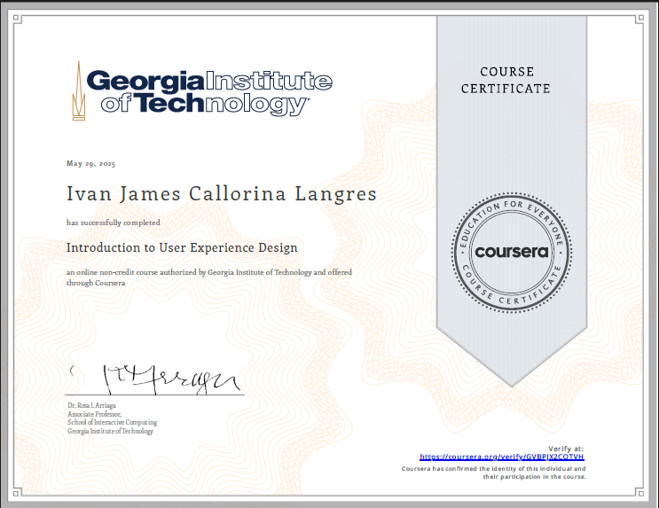

# My Portfolio
<h1>Hi, I'm Ivan James!   | <a href="https://github.com/IvanJames25">School Portfolio</a> | <a href="www.linkedin.com/in/ivan-james-langres-aa93bb275">Linkedin Portfolio</a> | <a href="https://www.figma.com/design/pHAOW9XRJTtZFc4CsqkBm0/HCI?node-id=69-946&p=f&m=draw">Figma Prototype</a> | </h1>

<h2>Introduction</h2>

- <b>Hi, my name is Ivan James, and I’m a student with a strong passion for design, technology, and data. I’ve been learning UX/UI design and have already created some prototypes using Figma, which helped me understand how to design user-friendly digital experiences. I’m also eager to learn coding so I can turn my designs into real, working products. In addition, I’m interested in data analysis and want to explore how data can improve user experiences and guide better design decisions. I’m excited to keep learning and growing in all these areas.</b>

<h2>Member of Team ADL</h2>

<h2>Introduction</h2>
<b><h4>TEAM ADL - AVILA, DORADO, LANGRES</h4></b>

<b>CYFER is a modern, secure, and user-friendly password manager
designed to address these needs by providing encrypted vaults,
intuitive interfaces, and seamless synchronization across devices,
ensuring that users can store, manage, and retrieve their credentials
safely and efficiently.</b>

<h2><b>| Usage instructions |</h2>

<h2>User Authentication</h2>

A.Login to CYFER vault 

B.Multi-factor authentication (optional) 

<h2>Password Management</h2>

A.Add new credentials (username, password, URL) 

B.Edit existing credentials 

C.Delete credentials 

<h2>Organizing Credentials</h2>

A.Create categories or folders 

B.Move credentials between folders 

<h2>Password Retrieval</h2>

A.Search for credentials by keyword or category 

B.Copy or auto-fill passwords 

<h2>Synchronization</h2>

A.Sync vault data across devices 

<h2>Settings and Security</h2>

A.Change master password 

B.Enable biometric authentication 

C.Configure synchronization preferences 

<h2> | User Manual | </h2>
<h2> | <a href="https://www.figma.com/design/pHAOW9XRJTtZFc4CsqkBm0/HCI?node-id=69-946&p=f&m=draw">Figma Prototype</a> | </h2>

- <b><a href="https://malayancollegesmindanaoo365-my.sharepoint.com/personal/macavila_mcm_edu_ph/_layouts/15/onedrive.aspx?id=%2Fpersonal%2Fmacavila%5Fmcm%5Fedu%5Fph%2FDocuments%2F2024%2D2025%2FHCI%2FModule%202%2FTEAM%20ADL%2Epdf&parent=%2Fpersonal%2Fmacavila%5Fmcm%5Fedu%5Fph%2FDocuments%2F2024%2D2025%2FHCI%2FModule%202&ga=1">[ Part 1 ]</a> | <a href="https://malayancollegesmindanaoo365-my.sharepoint.com/personal/ijlangres_mcm_edu_ph/_layouts/15/onedrive.aspx?id=%2Fpersonal%2Fijlangres%5Fmcm%5Fedu%5Fph%2FDocuments%2FModule%203%2FDESIGN%20ALTERNATIVES%2Epng&parent=%2Fpersonal%2Fijlangres%5Fmcm%5Fedu%5Fph%2FDocuments%2FModule%203&ga=1">[ Part 2 ]</a> | <a href="https://malayancollegesmindanaoo365-my.sharepoint.com/:w:/g/personal/ejdorado_mcm_edu_ph/EQELtWsA6F1OsLbzD35A_DsBEkWKnNCkQkWNZhCe03pu4w?e=OzR5lL">[ Activity No. 8 and 9 ]</a> |  <a href="https://malayancollegesmindanaoo365-my.sharepoint.com/personal/ejdorado_mcm_edu_ph/_layouts/15/onedrive.aspx?ga=1&id=%2Fpersonal%2Fejdorado%5Fmcm%5Fedu%5Fph%2FDocuments%2FADL%5FAVILA%5FDORADO%5FLANGRES%20PART%203%2FPART%203%2E1%20SYSTEM%20PROTOTYPE%5FADL%2DCYFER%2Epdf&parent=%2Fpersonal%2Fejdorado%5Fmcm%5Fedu%5Fph%2FDocuments%2FADL%5FAVILA%5FDORADO%5FLANGRES%20PART%203">[ Part 3.1 ]</a> | <a href="https://malayancollegesmindanaoo365-my.sharepoint.com/personal/ejdorado_mcm_edu_ph/_layouts/15/onedrive.aspx?ga=1&id=%2Fpersonal%2Fejdorado%5Fmcm%5Fedu%5Fph%2FDocuments%2FADL%5FAVILA%5FDORADO%5FLANGRES%20PART%204%2FPART%204%20PROJECT%20PRESENTATION%20%2D%20ADL%2Epdf&parent=%2Fpersonal%2Fejdorado%5Fmcm%5Fedu%5Fph%2FDocuments%2FADL%5FAVILA%5FDORADO%5FLANGRES%20PART%204">[ Part 4 ]</a> | </b>

<h2>Certificates</h2>

### 1. <h1><a href="https://coursera.org/share/bdb35ef0604c4e05f7496c2a6a8a5746">Foundations of User Experience (UX) Design</a><h1/>

---

### 2. <h1><a href="https://www.coursera.org/account/accomplishments/verify/QFE1PN90IYRJ?utm_source=link&utm_medium=certificate&utm_content=cert_image&utm_campaign=sharing_cta&utm_product=course">Start the UX Design Process: Empathize, Define, and Ideate</a><h1/>

---

### 3. <h1><a href="https://coursera.org/share/b603f8fbaa5cec0154bb7cbaf5d1dbc0">Build Wireframes and Low-Fidelity Prototypes</a><h1/>

---

### 5. <h1><a href="https://coursera.org/share/080dfa9eff6f4299ccb3615b1d227cd9">Create High-Fidelity Designs and Prototypes in Figma</a><h1/>

---

### 6. <h1><a href="https://coursera.org/share/6b9b6f2d6bef8b18315d32cb16d464ce">Input and Interaction</a><h1/>

---

### 7. <a href="https://coursera.org/share/0114e3bfbf6701d94466de820cba3a7b">Introduction to User Experience Design</a><h1/>

